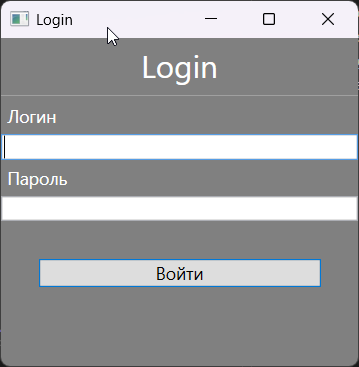
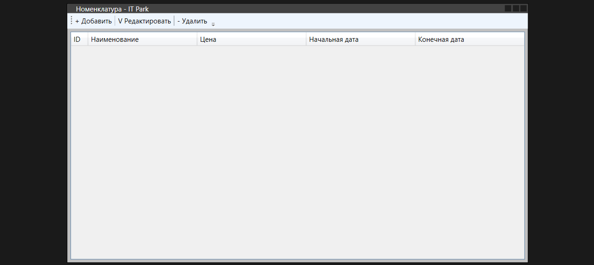
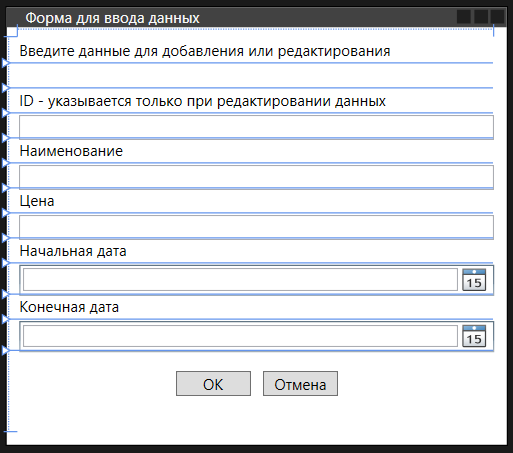
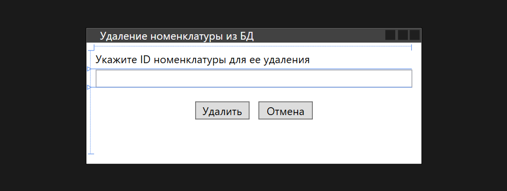

# Nomenclature Manager


A Windows desktop CRUD application built with **WPF** and **ADO.NET** for managing a product nomenclature catalog. Features user authentication, full product lifecycle management, and a stored procedure-driven data layer.

---

## Screenshots

| Login | Main View |
|-------|-----------|
|  |  |

| Add / Edit | Delete |
|------------|--------|
|  |  |

---

## Features

- **Secure Login** — credential validation against a `users` table via a database function
- **Product Catalog** — view all nomenclature items in a sortable DataGrid
- **Add / Edit** — form with full input validation (price format, date range constraints)
- **Delete** — confirmation-protected deletion flow
- **Stored Procedure Layer** — all CRUD operations routed through a single `iud_nomenclature` procedure using an I/U/D flag pattern
- **Connection String Externalized** — configured via `App.config`, no hardcoded credentials

---

## Tech Stack

| Layer | Technology |
|-------|-----------|
| UI | WPF (XAML) |
| Language | C# / .NET Framework 4.7.2 |
| Data Access | ADO.NET (`SqlConnection`, `SqlDataAdapter`) |
| Database | SQL Server LocalDB |
| DB Interaction | Stored procedures + scalar functions |
| Config | `System.Configuration` / `App.config` |

---

## Database Schema

### `users`
| Column | Type | Notes |
|--------|------|-------|
| `id_user` | INT IDENTITY | Primary Key |
| `login` | NVARCHAR | Unique |
| `pass` | NVARCHAR | — |

### `nomenclature`
| Column | Type | Notes |
|--------|------|-------|
| `id_nomenclature` | INT IDENTITY | Primary Key |
| `name` | NVARCHAR | Product name |
| `price` | NUMERIC(18,2) | — |
| `fromDate` | DATE | Price validity start |
| `toDate` | DATE | Price validity end |

### Stored Procedure Pattern
All write operations use a single procedure `iud_nomenclature` with a flag parameter:

```sql
EXEC iud_nomenclature @flag = 'I', @name = ..., @price = ..., @fromDate = ..., @toDate = ...  -- Insert
EXEC iud_nomenclature @flag = 'U', @id_nomenclature = ..., ...                                 -- Update
EXEC iud_nomenclature @flag = 'D', @id_nomenclature = ...                                      -- Delete
```

---

## Getting Started

### Prerequisites

- Windows OS
- [Visual Studio 2019+](https://visualstudio.microsoft.com/) with the **.NET desktop development** workload
- SQL Server Express / LocalDB (`(LocalDb)\MSSQLLocalDb`)

### Setup

1. **Clone the repository**
   ```bash
   git clone https://github.com/denis-mikhalev/AppToAccessAndUpdateDB.git
   cd AppToAccessAndUpdateDB
   ```

2. **Create the database**

   Open SQL Server Management Studio (or VS SQL tools) and execute the script:
   ```
   SQL Query - Creating and filling tables/SQLQuery1.sql
   ```
   This creates the `ITPark` database, tables, stored procedures, and seed data.

3. **Open the solution**
   ```
   NomenclatureManager/NomenclatureManager.sln
   ```

4. **Run**

   Press `F5` in Visual Studio. Default credentials from seed data:
   - Login: `user1` / Password: `pass1`

---

## Project Structure

```
NomenclatureManager/
├── NomenclatureManager.sln
└── NomenclatureManager/
    ├── LoginScreen.xaml(.cs)   # Authentication window
    ├── MainWindow.xaml(.cs)    # Product list with DataGrid
    ├── AddEdit.xaml(.cs)       # Add / Edit form
    ├── DeleteNom.xaml(.cs)     # Delete confirmation window
    ├── App.config              # Connection string
    └── App.xaml(.cs)           # Application entry point

SQL Query - Creating and filling tables/
└── SQLQuery1.sql               # Full DB setup script
```

---

## License

This project is licensed under the [MIT License](LICENSE).  
© 2026 Denis Mikhalev
